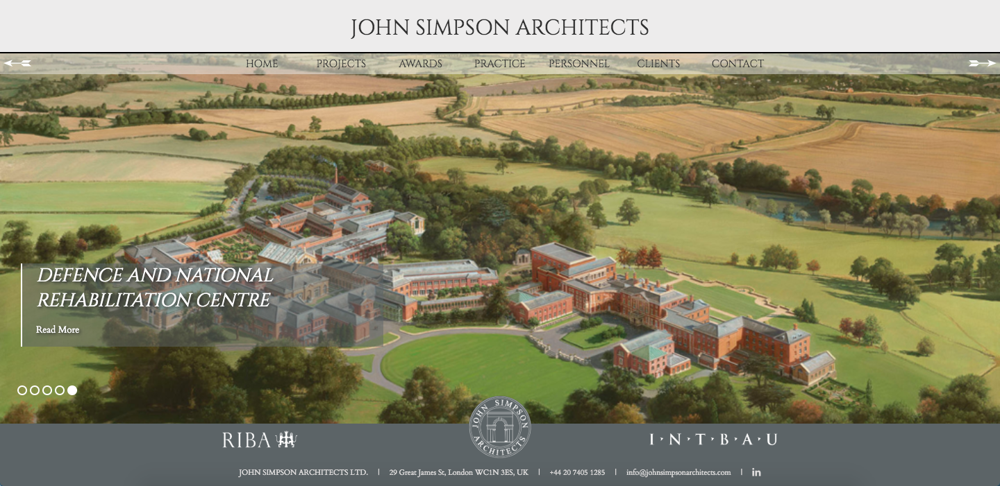

# John Simpson Architect's website.

This is a very, very old project. When I was asked by the studio to help with their website I had barely seen much html or css, let alone js. I have not worked on it since then so please do not look too close to my code here. I learned a lot with this project and it was really hard work. **It is fully responsive!** The good thing is the studio liked the result and they are still using it. There is no CMS, though. I showed them how to tweak things within the code and surprisingly enough it works every time they update it!

John Simpson Architects is an award-winning architectural practice in London.
