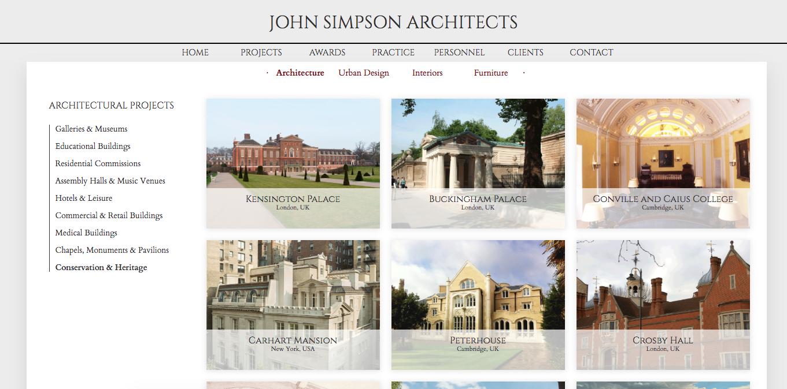
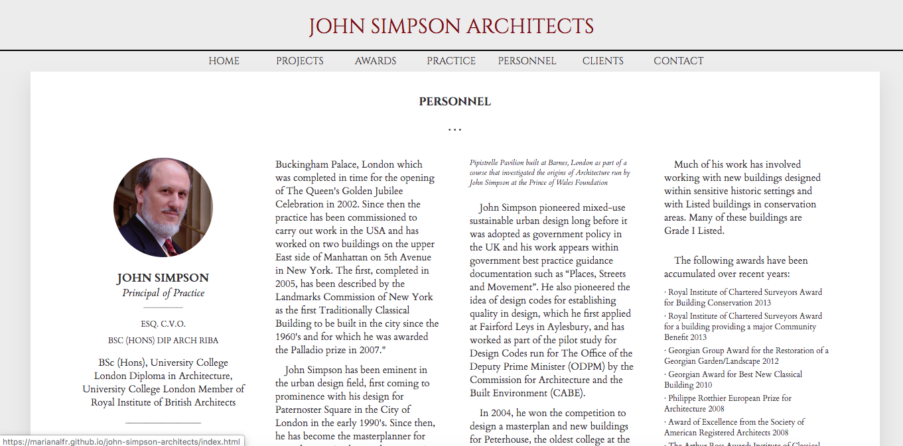
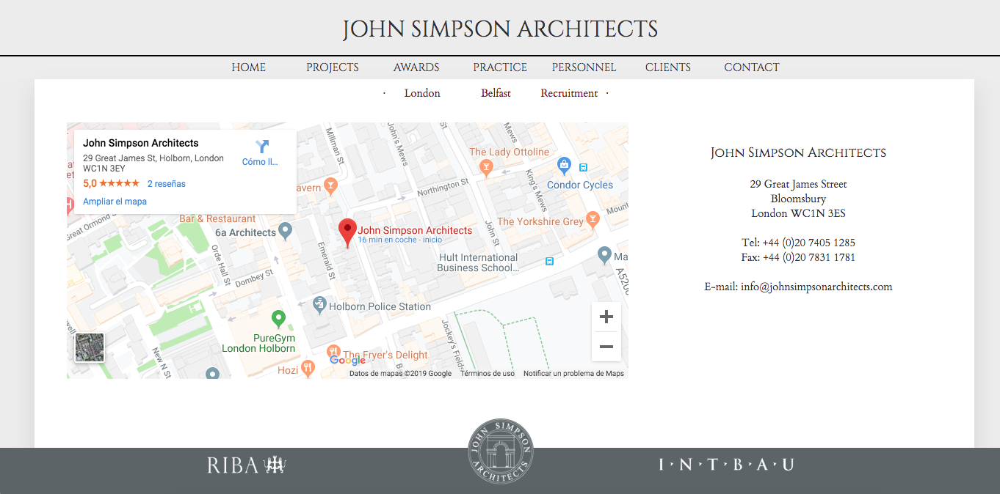

# John Simpson Architects' website.

This is a very, very old project. When I was asked by the studio to help with their website I had barely seen much html or css, let alone js. I have not worked on it since then so please do not look too close to my code here. I learned a lot with this project and it was really hard work. **It is fully responsive!** The good thing is the studio liked the result and they are still using it. There is no CMS, though. I showed them how to tweak things within the code and surprisingly enough it works every time they update it!

[John Simpson Architects](http://www.johnsimpsonarchitects.com/) is an award-winning architectural practice in London.

### Technologies

* HTML.
* CSS.
* Third-party javascript scripts.

### MIT License.

Copyright (c) 2019 Skylabers

Permission is hereby granted, free of charge, to any person obtaining a copy
of this software and associated documentation files (the "Software"), to deal
in the Software without restriction, including without limitation the rights
to use, copy, modify, merge, publish, distribute, sublicense, and/or sell
copies of the Software, and to permit persons to whom the Software is
furnished to do so, subject to the following conditions:

The above copyright notice and this permission notice shall be included in all
copies or substantial portions of the Software.

THE SOFTWARE IS PROVIDED "AS IS", WITHOUT WARRANTY OF ANY KIND, EXPRESS OR
IMPLIED, INCLUDING BUT NOT LIMITED TO THE WARRANTIES OF MERCHANTABILITY,
FITNESS FOR A PARTICULAR PURPOSE AND NONINFRINGEMENT. IN NO EVENT SHALL THE
AUTHORS OR COPYRIGHT HOLDERS BE LIABLE FOR ANY CLAIM, DAMAGES OR OTHER
LIABILITY, WHETHER IN AN ACTION OF CONTRACT, TORT OR OTHERWISE, ARISING FROM,
OUT OF OR IN CONNECTION WITH THE SOFTWARE OR THE USE OR OTHER DEALINGS IN THE
SOFTWARE.
